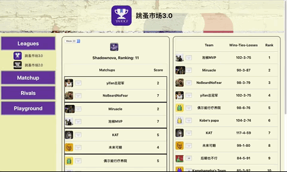

# Fantasy Basketball Domina (FBD)
Fantasy basketball Domina is a helper tool for yahoo fantasy gamers. It automatically synchronizes status of all your yahoo fantasy leagues and teams. Moreover, it also provides extra features include (rivals, result prediction and transaction recommendation) 

**Tech:** Typescript, React (Hooks), GraphQL, Node/Express, NoSQL/MongoDB, Yahoo API (OAuth2), react-vis

## Table of Contents
* [Preview](#Preview)
* [Design](#Design)
* [Development](#Development)
* [References](#References)

## Preview

| Login with Yahoo! | View All Your Leagues |
|:---:|:---:|
| |  |

| Rivals | 
|:---:|
| | 

## Design
As a helper tool for fantasy basketball gamers, FBD aimed to provide data visualization, stats tracking and prediction to save gamers time when they play the game. As a result, the following features are designed.

### Features
* **Integrated Info:** display all leagues and teams of user at any week.
* **Rivals:** Add other gamers as your rival and tracking user's team with rivals' even when they don't matchup.
* *Matchup:* display user's current matchup with stats visulization and predict the final win and loss based on rosters.
* *Playground:* compare selected players in different season under the current leagues rules.

### Solution for heavily nesting data
After a quick skim of data from Yahoo API, it is found that data was heavily nested. It can go as deep as 50 layers. To simplify the data at the front end, [GraphQL](https://graphql.org) is considered to solve the issue.


## Development

### Authenticate with Yahoo and Data Sync
Yahoo Fantasy API recently updates to OAuth2 for authentication. [Passport](http://www.passportjs.org/) strategy is neccessary to implement authentication. However, the current [passport-yahoo](http://www.passportjs.org/packages/passport-yahoo-oauth/) strategy is not up to date. As a result, [passport-oauth2](http://www.passportjs.org/packages/passport-oauth2/) is used instead for authentication.

And for authentication, yahoo api only sends back yahooId and email. To obtain more detailed info of user, an extra endpoint is called to obtain details.

```typescript
passport.use(new OAuth2Strategy({
  clientID: process.env.YAHOO_CONSUMER_KEY,
  clientSecret: process.env.YAHOO_CONSUMER_SECRET,
  callbackURL: "/auth/yahoo/callback",
  authorizationURL: 'https://api.login.yahoo.com/oauth2/request_auth',
  tokenURL:'https://api.login.yahoo.com/oauth2/get_token'
},
function(accessToken: string, refreshToken: string, profile: any, cb) {
  console.log('authorized by yahoo with: ', accessToken);
  let config = {
    headers: {
      'Authorization': `Bearer ${accessToken}`
    }
  }

  // for getting more detail info from user
  axios.get('https://fantasysports.yahooapis.com/fantasy/v2/users;use_login=1/profile?format=json', config).then(response => {
    let userInput = {
      yahooId: response.data.fantasy_content.users[0].user[0].guid,
      name: response.data.fantasy_content.users[0].user[1].profile.display_name,
      avatar: response.data.fantasy_content.users[0].user[1].profile.image_url 
    }
    console.log('get user info back: ', userInput);
    return cb(null, {...userInput, accessToken})
  }).catch(err => {
    console.log('error through authorization: ', err);
  })
}))

passport.serializeUser(function(user,cb) {
  cb(null, user);
});
passport.deserializeUser(function(obj, cb) {
  cb(null, obj)
})
```

### GraphQL or not? => hybrid
As integrating graphql into FBD, it does simply the data at front end. However, the trading the data simplicity with backend server power can clearly be seen as for many cases, 3 or more api endpoints were called even when data for only one endpoint is needed. To improve flexiblity, a server with both graphql and restful routes.

**GraphQL**
```typescript
//an example of graphql resolver for fantasy league
//all 3 endpoints will be called even when only one of them is needed.

const getLeagues = ({token}: {token: string}): Promise<ILeague[] | void> => {
  return axios.get('https://fantasysports.yahooapis.com/fantasy/v2/users;use_login=1/games;game_code=nba/leagues?format=json', config).then(response => {
    //....some code.....
  })
}

const getStanding = (token:string, leagueKey: string): Promise<ITeam[]> => {
  return axios.get(`https://fantasysports.yahooapis.com/fantasy/v2/leagues;league_keys=${leagueKey}/standings?format=json`, config).then(response => {
    //....some code......
  })
}

const getScoreBoard = (token: string, week: string, leagueKey: string): Promise<IMatchup[]> => {
  return axios.get(`https://fantasysports.yahooapis.com/fantasy/v2/leagues;league_keys=${leagueKey}/scoreboard;week=${week}?format=json`, config).then(response => {
    //....some code ...
  })
}
//....
```

**Restful Route**

| Routes | Methods | Notes |
|:------:|:-------:|:-----:|
| /api/leagues/:key/standings | GET | get standing for the league with the key |
| /api/leagues/:key/scoreboard | GET | get scoreboard for the league with the key |
| /api/rivals | POST | add a rival to user for tracking |
| /api/rivals/:key | DELETE | remove a rival for user |
| /api/players | POST | add a player to user's watchlist |
| /api/players/:key | DELETE | remove a player from user's watchlist |
| /api/userdetails | GET | get user info include watchlist and rivals |

## References
* **[Yahoo API](https://developer.yahoo.com/api/)**: for get status for user fantasy basketball team.
* **[Y! Fantasy API](http://yfantasysandbox.herokuapp.com/)**: for examples for Yahoo Fantasy API.
* **[Passport](http://www.passportjs.org/)**: for OAuth authentication for yahoo api.
* **[Stack Overflow](https://stackoverflow.com/)**: for quesionts and errors.
* **[W3School](https://www.w3schools.com/)**: for CSS, HTML and Javascript documents.
